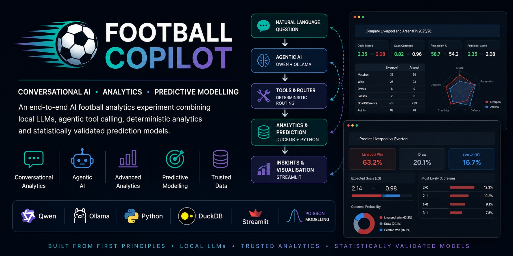
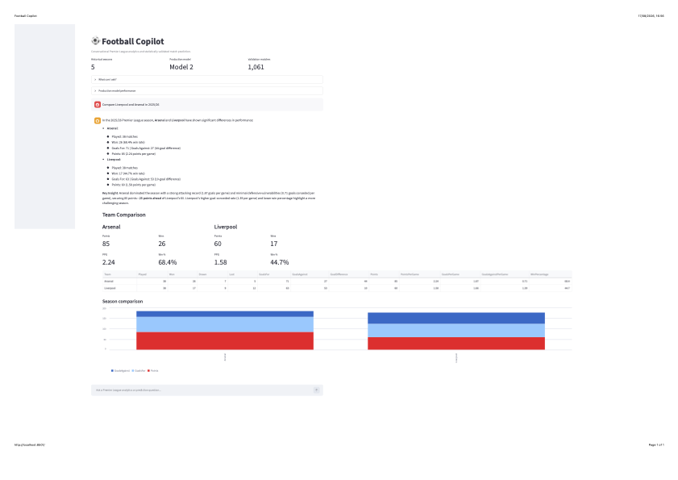
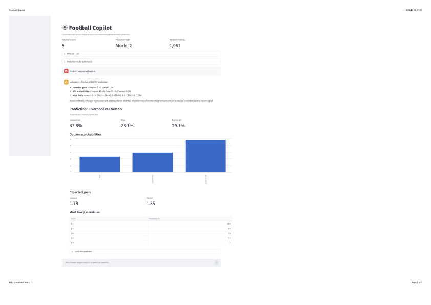
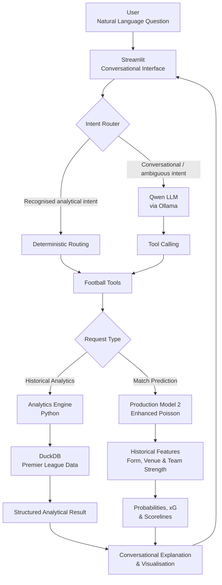

# Football Copilot



Football Copilot is a personal AI and analytics experiment I built to deepen my practical understanding of how modern agentic AI applications work end-to-end.

Rather than using an orchestration framework such as LangChain or LangGraph, I built the core components from first principles to understand what is happening underneath the abstraction layer.

The project combines:

- local LLM inference with Qwen and Ollama
- deterministic tool routing
- conversational football analytics
- DuckDB
- Streamlit
- predictive modelling
- walk-forward validation
- model challenger testing
- historical bookmaker market benchmarking

I chose Premier League football as the domain because it provides a practical environment for experimenting with both conversational analytics and probabilistic prediction.

The objective was not simply to build a chatbot.  It was to understand where an LLM adds value, where deterministic analytics should remain in control, and how statistical models can be exposed through a conversational interface.

## What it demonstrates

Football Copilot demonstrates an end-to-end AI and analytics workflow:

```text
Natural-language question
        ↓
Intent detection
        ↓
Deterministic router / LLM tool calling
        ↓
Trusted analytical or prediction tool
        ↓
Structured result
        ↓
LLM explanation
        ↓
Streamlit visualisation
```

## Project Objective

The project had two main objectives.

### Part 1: Conversational football analytics

Allow a user to ask natural-language questions such as:

- How did Liverpool perform in 2025/26?
- Show Liverpool's last 10 matches.
- Compare Liverpool and Arsenal in 2025/26.
- Compare Liverpool's home and away performance.
- Show the Premier League table.

The LLM does not calculate these statistics itself.

Football Copilot routes the request to deterministic analytical tools that query the local football data and returns the result conversationally.

### Part 2: Predictive football analytics

Extend Football Copilot to estimate the probabilities of future match outcomes.

Example:

```text
Liverpool vs Arsenal

Liverpool win probability
Draw probability
Arsenal win probability

Expected goals
Most likely scorelines
```

## Football Copilot in Action

### Conversational analytics



### Statistical match prediction



## Architecture

Football Copilot separates conversational AI from the analytical and predictive calculations.  The LLM interprets and explains, while trusted Python tools and statistical models produce the underlying results.


## Getting Started

Football Copilot can be run directly from a clean clone of the repository.  The runtime data and frozen production model required by the application are versioned with the project, so rebuilding the modelling pipeline is not required for normal use.

### Prerequisites

- Git
- Python 3.13
- Ollama
- Qwen3 4B (`qwen3:4b`) for conversational AI functionality

Install Ollama separately, then download the local language model:

```bash
ollama pull qwen3:4b
```

### Clone the project

```bash
git clone https://github.com/dhandan/football-copilot.git
cd football-copilot
```

### Create a virtual environment

Windows PowerShell:

```powershell
py -3.13 -m venv .venv
.\.venv\Scripts\Activate.ps1
```

macOS:

```bash
python3.13 -m venv .venv
source .venv/bin/activate
```

### Install dependencies

```bash
python -m pip install -r requirements.txt
```

### Validate the installation

Football Copilot includes a validation gate that checks the required runtime artefacts, database integrity and core analytics functions:

```bash
python scripts/validate_project.py
```

A successful installation ends with:

```text
FOOTBALL COPILOT VALIDATION PASSED
```

### Run Football Copilot

Ensure Ollama is running, then start the Streamlit application:

```bash
streamlit run app/streamlit_app.py
```

Streamlit will provide the local URL for Football Copilot.

### Rebuilding the modelling pipeline

A normal installation does **not** require the historical data or production model to be rebuilt.

For development work that deliberately regenerates the data, features and frozen production model, use:

```bash
python scripts/build_project.py
```

This is the full regeneration pipeline and may retrieve source data from external providers.  Run it only when intentionally rebuilding the project artefacts rather than as part of normal setup.

### Design principle

The LLM is **not the source of truth for football statistics or predictions**.

Football Copilot uses the LLM for natural-language interpretation and explanation, while deterministic analytical tools and the statistical prediction model perform the calculations.

This architecture reduces the risk of hallucinated statistics while retaining a conversational user experience.